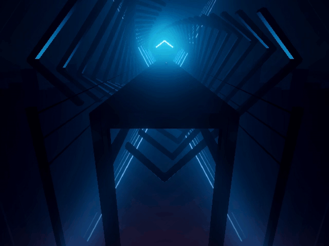

# Disappearin gNotes

Changes how the Ghost Notes modifier works. This is primarily meant to make Ghost Notes more easily viewable on the Desktop but can also be enabled in VR (Disables Score Submission).

Instead of only showing the blocks arrow, this will show and fade out the entire note. The distance at which the note becomes hidden, and over which the note fades out can be customized.

**This does not work when you use Custom Notes**

Commissioned by [LackWiz]( https://twitter.com/LackWiz )

---

Currently compatible game versions: **1.21.0 and up**

## Install

#### You can always find the latest download in [The Releases](https://github.com/kinsi55/BeatSaber_DisappearingNotes/releases), simply drag the Plugin DLL into the Plugins folder